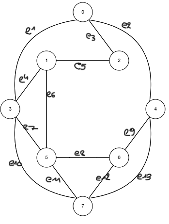

# Search fundamentals

## What is a data structure and give some concrete examples of data structures?
A data structure is a way of organizing and storing data so that it can be accessed and modified efficiently. Examples of data structures are arrays, linked lists, stacks, queues, trees, graphs, and hash tables.

## Explain the following terms: graph, vertex, node and edge.
A graph is a data structure that consists of nodes (or vertices) and edges connecting them. Each node represents a state or entity, while edges represent the connections or relationships between these states​. A vertex is a node in a graph, and an edge is a connection between two vertices.

## *Given*: a graph
* Assignment: determine the 'array of edges', 'incidence matrix' and 'adjacency matrix' of the graph.

<b>Array edges:</b>[[0,3] [0,2] [0,4] [1,2] [1,3] [1,5] [2,0] [2,1] [3,0] [3,1] [3,5] [3,7] [4,0] [4,6] [4,7] [5,1] [5,3] [5,6] [5,7] [6,4] [6,5] [6,7] [7,3] [7,5] [7,4] [7,6] ]  
<b>Adjacency matrix:</b> 

|   | 0 | 1 | 2 | 3 | 4 | 5 | 6 | 7 |
|---|---|---|---|---|---|---|---|---|
| 0 | 0 | 0 | 1 | 1 | 1 | 0 | 0 | 0 |
| 1 | 0 | 0 | 1 | 1 | 0 | 1 | 0 | 0 |
| 2 | 1 | 1 | 0 | 0 | 0 | 0 | 0 | 0 |
| 3 | 1 | 1 | 0 | 0 | 0 | 1 | 0 | 1 |
| 4 | 1 | 0 | 0 | 0 | 0 | 0 | 1 | 1 |
| 5 | 0 | 1 | 0 | 1 | 0 | 0 | 1 | 1 |
| 6 | 0 | 0 | 0 | 0 | 1 | 1 | 0 | 1 |
| 7 | 0 | 0 | 0 | 1 | 1 | 1 | 1 | 0 | 

 
<b>Incidence matrix:</b>  

|   | e1 | e2 | e3 | e4 | e5 | e6 | e7 | e8 | e9 | e10 | e11 | e12 | e13 |
|---|----|----|----|----|----|----|----|----|----|-----|-----|-----|-----|
| 0 | 1  | 1  | 1  | 0  | 0  | 0  | 0  | 0  | 0  | 0   | 0   | 0   | 0   |
| 1 | 0  | 0  | 0  | 1  | 1  | 1  | 0  | 0  | 0  | 0   | 0   | 0   | 0   |
| 2 | 0  | 1  | 1  | 0  | 1  | 0  | 0  | 0  | 0  | 0   | 0   | 0   | 0   |
| 3 | 1  | 0  | 0  | 1  | 0  | 0  | 1  | 0  | 0  | 1   | 0   | 0   | 0   |
| 4 | 0  | 1  | 0  | 0  | 0  | 0  | 0  | 0  | 1  | 0   | 0   | 0   | 1   |
| 5 | 0  | 0  | 0  | 0  | 0  | 1  | 1  | 1  | 0  | 0   | 1   | 0   | 0   |
| 6 | 0  | 0  | 0  | 0  | 0  | 0  | 0  | 1  | 1  | 0   | 0   | 1   | 0   |
| 7 | 0  | 0  | 0  | 0  | 0  | 0  | 0  | 0  | 0  | 1   | 1   | 1   | 1   |

## *Explain*: a tree is a connected acyclic graph.
A tree is a graph where every node is connected, there are no cycles, and it resembles a hierarchy with a single root node and connected child nodes​. 

## Explain the following ‘tree’ terms: root node, parent node, sibling node, descendent, ancestor, leaf node, goal node, path, cost, degree and depth.
* Root node: The topmost node in a tree.
* Parent node: A node that has one or more child nodes.
* Sibling node: Nodes that share the same parent.
* Descendant: A node accessible by moving downwards from a specific node.
* Ancestor: A node accessible by moving upwards towards the root.
* Leaf node: A node with no children.
* Goal node: The target node in search or pathfinding.
* Path: A sequence of nodes and edges connecting nodes.
* Cost: Value representing the "expense" of moving along a path.
* Degree: Number of children a node has.
* Depth: The distance from the root to a particular node

## Explain the Breadth-First Search (BFS) algorithm and which data structure is used?
BFS is a search algorithm that explores a graph level by level, starting from the root node. It uses a queue data structure to keep track of nodes to visit next. The algorithm visits all nodes at the current level before moving to the next level.

## *Given*: a search tree
* Assignment: apply the Breadth-First Search (BFS) algorithm to find any solution. 
 &ensp; &ensp; &ensp; &ensp; &ensp; &ensp; &ensp; &ensp; A  
 &ensp; &ensp; &ensp; &ensp; &ensp; &ensp; &ensp; / &ensp;| &ensp;\  
 &ensp; &ensp; &ensp; &ensp; &ensp; &ensp; &ensp;B &ensp;C &ensp;D  
 &ensp; &ensp; &ensp; &ensp; &ensp; &ensp;    / &ensp;| &ensp; &ensp;| &ensp;\  
 &ensp; &ensp; &ensp; &ensp; &ensp;    E &ensp;F &ensp; &ensp; G &ensp;H  
 &ensp; &ensp; &ensp; &ensp; &ensp;/ &ensp;| &ensp; &ensp; &ensp; |  
 &ensp; &ensp; &ensp; &ensp; I &ensp;&ensp;J &ensp; &ensp; &ensp; K  
Start at the root node A, then visit B, C, D, E, F, G, H, I, J, K.

## Explain the Depth-First Search (DFS) algorithm and which data structure is used?
DFS is a search algorithm that explores as far along each branch as possible before backtracking, typically using a stack to manage the nodes. It traverses the depth of a tree or graph before moving to the next branch.

## *Given*: a search tree
* Assignment: apply the Depth-First Search (DFS) algorithm to find any solution.  
 &ensp; &ensp; &ensp; &ensp; &ensp; &ensp; &ensp; &ensp; A  
 &ensp; &ensp; &ensp; &ensp; &ensp; &ensp; &ensp; / &ensp;| &ensp;\  
 &ensp; &ensp; &ensp; &ensp; &ensp; &ensp; &ensp;B &ensp;C &ensp;D  
 &ensp; &ensp; &ensp; &ensp; &ensp; &ensp;    / &ensp;| &ensp; &ensp;| &ensp;\  
 &ensp; &ensp; &ensp; &ensp; &ensp;    E &ensp;F &ensp; &ensp; G &ensp;H  
 &ensp; &ensp; &ensp; &ensp; &ensp;/ &ensp;| &ensp; &ensp; &ensp; |  
 &ensp; &ensp; &ensp; &ensp; I &ensp;&ensp;J &ensp; &ensp; &ensp; K  
Start at the root node A, then visit B, E, I, F, J, C, D, G, K, H.
