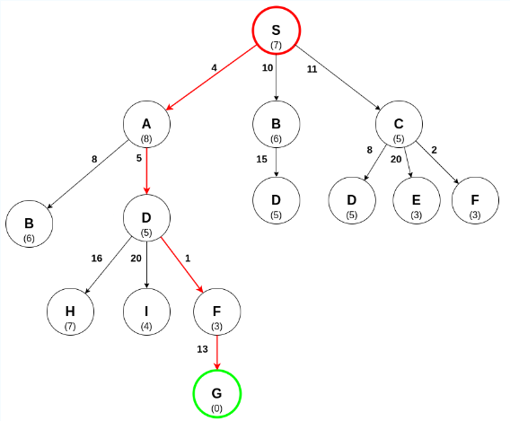
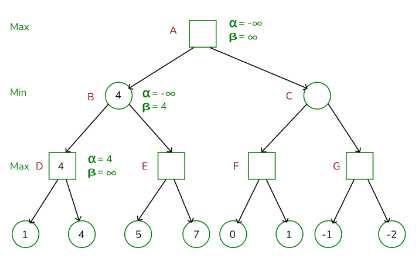

# Intelligent search

## Heuristics
* What is a heuristic?  
A heuristic is a rule or educated guess used to guide search algorithms, often defined by specific criteria to evaluate states in the search problem. It simplifies the search by providing context-specific guidance, allowing the algorithm to make decisions without evaluating every possible option​. 
* Why can heuristics improve the efficiency of search algorithms? 
Heuristics improve efficiency by focusing the search on promising paths and reducing computation time. By minimizing the exploration of less-likely solutions, heuristics help the algorithm converge toward an optimal or satisfactory solution faster than exhaustive search methods.
* Give a few concrete examples of heuristics.
    * A GPS navigation system using the shortest path heuristic to find the quickest route.
    * For a maze problem, a heuristic could prioritize paths with fewer obstacles or dead-ends.

## A* Search
* Explain how the A* search algorithm works.  
The A* algorithm combines the path cost from the start node with a heuristic cost estimate to reach the goal, prioritizing nodes with the lowest combined cost. Nodes are explored in an order that balances their path cost and estimated remaining cost to reach the goal, allowing efficient exploration toward the optimal solution​.
* How is the cost function determined?  
In the A* algorithm, the cost function is the sum of two components: the actual cost from the start node to the current node and the heuristic cost from the current node to the goal. This combination helps the algorithm prioritize nodes that are closer to the goal, both in terms of the actual distance traveled and the estimated remaining distance​.  
f(n) = g(n) + h(n)
    * Where f(n) is the total cost of the path through node n.
    * g(n) is the cost of the path from the start node to node n.
    * h(n) is a heuristic function that estimates the cost from node n to the goal.

## A* Search
* *Given*: a search tree
* *Question*: determine the sequence of searching the tree, using the A* search algorithm.  
*Example*:  
Start at the root node, evaluating each node by its combined cost (actual path cost + heuristic). The node with the lowest cost is expanded first, and the process continues until the goal is reached. Nodes are revisited and reordered based on new calculated costs as needed​.  
Find the optimal path from S to G using the A* search algorithm.  
  
Exploring S, we can go to A, B or C 
S -> A: f(A) = 8 + 4 = 12 
S -> B: f(B) = 6 + 10 = 16 
S -> C: f(C) = 5 + 11 = 16 
  
The next node to explore is A, with a cost of 12. From A, we can go to B or D 
S -> A -> B: f(B) = 6 + (8 + 4) = 18 
S -> A -> D: f(D) = 5 + (5 + 4) = 14 
  
The next node to explore is D, with a cost of 14. From D, we can go to H, I and F 
S -> A -> D -> H: f(H) = 7 + (16 + 5 + 4) = 32 
S -> A -> D -> I: f(I) = 4 + (20 + 5+ 4) = 33 
S -> A -> D -> F: f(F) = 3 + (1 + 5 + 4) = 13 
  
The next node to explore is F, with a cost of 13. From F, we can go to G 
S -> A -> D -> F -> G: f(G) = 0 + (13 + 1 + 5 + 4) = 23 
  
The goal has been found but we can continue to explore the tree to find the optimal path. The next node to explore is B. B has two entries, one at a cost of 16 and one at a cost of 18. We choose the one with the lowest cost 
S -> B -> D: f(D) = 5 + (15 + 10) = 30 
  
Because the cost of D is higher than the cost of F, we no longer need to explore this branch. The next node to explore is C. From C, we can go to D, E and F 
S -> C -> D: f(D) = 5 + (8 + 11) = 24 
S -> C -> E: f(E) = 3 + (20 + 11) = 34 
S -> C -> F: f(F) = 2 + (2 + 11) = 15 
The paths D and E are more expensive than the path to F, so we continue exploring the path to F. We already explored this path and the path with the lowest cost is the one we found earlier. The optimal path from S to G is S -> A -> D -> F -> G.
  

## Min-Max Adversarial Search
* Explain how the Min-Max adversarial search algorithm works.
The Min-Max algorithm simulates all possible moves in a game tree, scoring each possible outcome based on its favorability to the player. The algorithm alternates between maximizing the player's score and minimizing the opponent's, selecting moves that favor the player's best potential outcome while countering the opponent's moves. By exploring the game tree to a certain depth, the Min-Max algorithm determines the best move for the player based on the expected outcomes of each possible move.

## Min-Max Adversarial Search
* *Given*: a search tree with the cost of each leaf node
* *Question*: determine the value of each node in the min-max search tree.
*Example*:  
Start from the leaf nodes and work upwards, assigning values based on whether the current layer represents a minimizing or maximizing player. The Min-Max algorithm recursively assigns each parent node the best value of its child nodes, choosing the minimum or maximum as appropriate at each level​. 
 
 
 
 

## Alpha-Beta Pruning
* Explain how the alpha-beta pruning adversarial search algorithm works.
Alpha-beta pruning is an optimization technique for the Min-Max algorithm that reduces the number of nodes evaluated in the search tree. By maintaining two values, alpha and beta, representing the best possible scores for the maximizing and minimizing players, respectively, the algorithm prunes branches that cannot affect the final decision.
* What is alpha? What is beta?
    * Alpha: the best score that the maximizing player can achieve at any choice point along the path.
    * Beta: the best score that the minimizing player can achieve at any choice point along the path.
* What makes alpha-beta pruning a much more efficient search algorithm?
Alpha-beta pruning is more efficient because it avoids evaluating nodes that cannot affect the final decision. By maintaining the alpha and beta values, the algorithm prunes branches that are guaranteed to be worse than the current best option, reducing the search space and computation time significantly.

## Alpha-Beta Pruning
* *Given*: a search tree with the cost of each leaf node
* *Question*: determine the value of each node in the search tree and explain why certain branches in the search tree may be pruned.
*Example*:  
Starting from the leaf nodes, apply the alpha-beta pruning rules to determine the values of each node in the search tree. The parent nodes' values are updated based on the best possible scores for the maximizing and minimizing players. Prune branches where the alpha-beta values indicate that further exploration is unnecessary, as the current path is already suboptimal​.
Alpha is set to -∞ and beta is set to +∞.  

