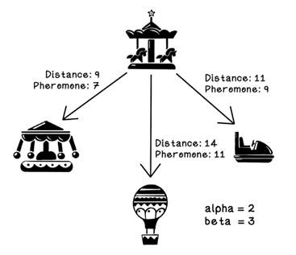

# Swarm intelligence

## Swarm intelligence

- Explain what swarm intelligence is and on what principles is this form of intelligence based.  
  Swarm intelligence is a form of collective intelligence that is based on the collective behavior of decentralized, 
  self-organized systems. The key principles behind SI are self-organization, decentralization, and indirect communication 
  (often through pheromones or similar markers in biological analogs), 
  enabling individuals to solve complex problems collectively by following simple rules without central control.
- Why is the analogy to ants selected in the ant optimization algorithm?  
  Ant colony optimization algorithms take inspiration from the foraging behavior of ants, 
  which use pheromones to mark paths between their nest and food sources. 
  This collective strategy helps ants converge to the shortest path, optimizing resource use. 
  The ACO algorithm mimics this behavior by simulating virtual "pheromone" trails, guiding artificial agents toward optimal 
  solutions through path reinforcement.

## Ant colony optimization algorithm

- Discuss the different steps in the ant colony optimization algorithm
    1. Initialize pheromone trails: Set up all pheromone trails between nodes and initialize the intensity of the pheromones.
    2. Set up population of ants: Create a population of ants in which each ant is placed at a random starting node.
    3. Choose the next destination: Ants select the next destination based on pheromone intensity and distance heuristics until all nodes are visited.
    4. Update the pheromone trails: Update the intensity of the pheromones on the paths based on the ant's movement, as well as the evaporation rate.
    5. Update the best solution: Update the best solution, given the total distance traveled by the ants.
    6. Stop criteria: Determine when to stop the algorithm based on a predefined condition (e.g., number of iterations or convergence).
- Discuss the mathematical formula for destination selection based on pheromones and distance heuristics.  
  The probability of selecting a path is calculated using the formula:
  $$\frac{{\text{{(pheromones on path x)}}^a \cdot \left( \frac{1}{\text{{heuristic for path x}}} \right)^b}}{{\sum_{\text{{n of available destinations}}} \text{{(pheromones on path n)}}^a \cdot \left( \frac{1}{\text{{heuristic for path n}}} \right)^b}}$$
    where:
    - $a$ (aplha) is set to 1.0 and represents the influence of pheromones on the selection.
    - $b$ (beta) is set to 2.0 and represents the influence of distance heuristics on the selection.
- How is the best solution ultimately determined?  
    The best solution is determined based on the total distance traveled by the ants in each iteration. The path with the shortest total distance is considered the best solution.
- What criteria can be used to stop the algorithm?  
    The algorithm can be stopped based on predefined criteria such as:
    - A maximum number of iterations.
    - Convergence of the solution.
    - A specific threshold for the improvement in the best solution.

## Ant colony optimization algorithm - selection of the destination

- _Given_: a figure showing the distances between different objects and the intensity of the pheromones on each of the paths.  

- _Question_: discuss how the destination with the highest probability is determined. Use the mathematical formula for selecting the destination and choose your own value for alpha and beta.  
    To determine the destination with the highest probability, we calculate the probability of selecting each path based on the pheromone intensity and distance heuristics. Let's assume $\alpha = 2.0$ and $\beta = 3.0$ for this example.
    - For the path from Carousel to Swings: $${{(7)^2 \cdot \left( \frac{1}{9} \right)^3}} \approx 0.067$$
    - For the path from Carousel to Balloons: $${{(11)^2 \cdot \left( \frac{1}{14} \right)^3}} \approx 0.044$$
    - For the path from Carousel to Roller Coaster: $${{(9)^2 \cdot \left( \frac{1}{11} \right)^3}} \approx 0.061$$

    The sum of these probabilities is $0.067 + 0.061 + 0.044 = 0.172$.

    - For the path from Carousel to Swings: $$0.067/ 0.172 \approx 0.390$$
    - For the path from Carousel to Balloons: $$0.044/ 0.172 \approx 0.256$$
    - For the path from Carousel to Roller Coaster: $$0.061/ 0.172 \approx 0.355$$
