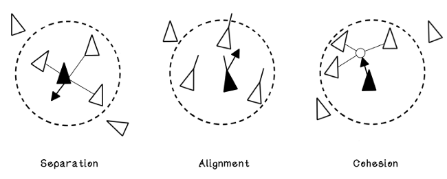
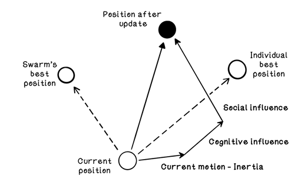

# Chapter 7 Swarm intelligence: particles

## Particle swarm intelligence: bird flocks
* What do the following terms mean for simulating the movement of individual birds in relation to bird flocks?
    - <b>Alignment</b>:
    An individual should steer in the average heading of its neighbors to ensure that the group travels in a similar direction.
    - <b>Cohesion</b>:
    An individual should move toward the average position of its neighbors to maintain the formation of the group.
    - <b>Separation</b>:
    An individual should avoid crowding or colliding with its neighbors to ensure that individuals not collide disrupting the group.

## Particle swarm optimization algorithm
* Discuss the different steps in the particle swarm optimization life cycle algorithm.
    1. Initialize the population of particles: Define the number of particles and initialize their positions and velocities randomly within the search space.
    2. Calculate the fitness of each particle: Evaluate the fitness of each particle based on the problem's fitness function at their current positions.
    3. Update the position of each particle: Update each particle's velocity and position using swarm intelligence principles​.
    4. Determine the stopping criteria: Define conditions to terminate the algorithm, such as reaching a maximum number of iterations or stagnation in finding better solutions​.
* Discuss how the position of the particles is updated.  
    The new position of the particle is calculated based on the current position, velocity, and the best position found by the particle and the swarm.
    * New velocity = inertia component + cognitive component + social component
        * Inertia component: The particle's current velocity multiplied by a constant inertia weight.  
        Inertia * current velocity
        * Cognitive component: The particle's best position found so far subtracted from the current position multiplied by a constant cognitive weight.  
        Cognitive acceleration = cognitive constant * random number  
        Cognitive acceleration * (best position - current position)
        * Social component: The swarm's best position found so far subtracted from the current position multiplied by a constant social weight.  
        Social acceleration = social constant * random number  
        Social acceleration * (best position - current position)
        

* How is the best solution ultimately determined?
    The best solution is determined by evaluating the fitness of each particle based on the problem's fitness function. The particle with the best fitness value is considered the best solution found by the algorithm.

* What criteria can be used to stop the algorithm?
    * Maximum number of iterations: The algorithm stops after a predefined number of iterations.
    * Stagnation: The algorithm stops when the best solution does not improve over a certain number of iterations.

## Particle swarm optimization algorithm
* Explain the following relation:
    * New velocity = inertia component + cognitive component + social component
* What is the function of?
    * The inertia component 
        Maintains the particle's current velocity to balance exploration and exploitation.
    * The cognitive component
        Guides the particle towards its best position found so far.
    * The social component
        Guides the particle towards the swarm's best position found so far.